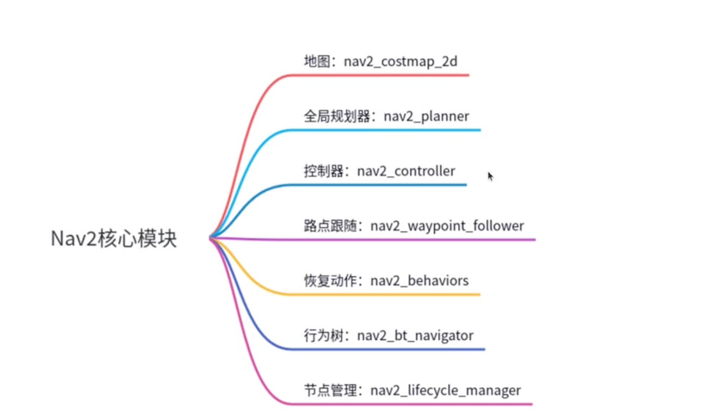
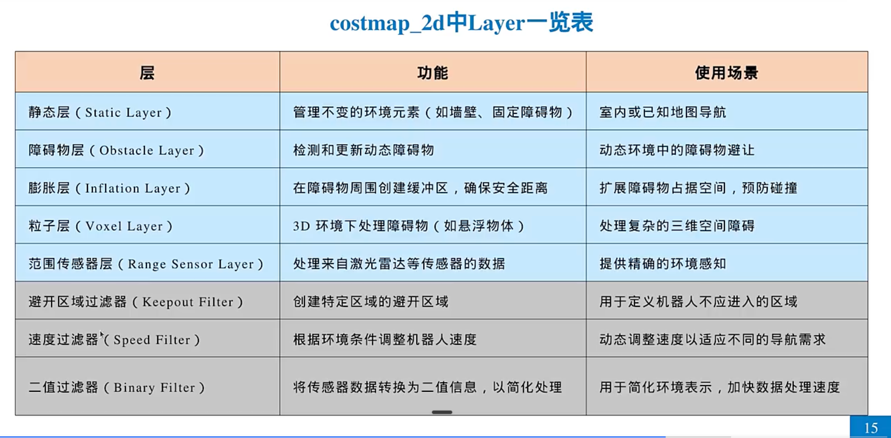

# navigation2
- Navigation2 官方教程: https://navigation.ros.org/index.html
- Navigation2 官方github: https://github.com/ros-planning/navigation2


## 基于结构化地图的搜索
- 朴素的搜索思想：BFS,DFS
- 搜索算法升级: Dijkstra,A*


## Navigation2


## 名词介绍
- 代价地图(costmap)
```text
在一个给定的环境中为每个位置分配一个"代价"值，这些值反映了通过该位置的难易程度。这种映射有助于机器人确定避开障碍物和危险区域的最佳路径。
```
- 分层代价地图

```text
```


1、用python 写dj
2、用python 写A *
3、安装navigation2
